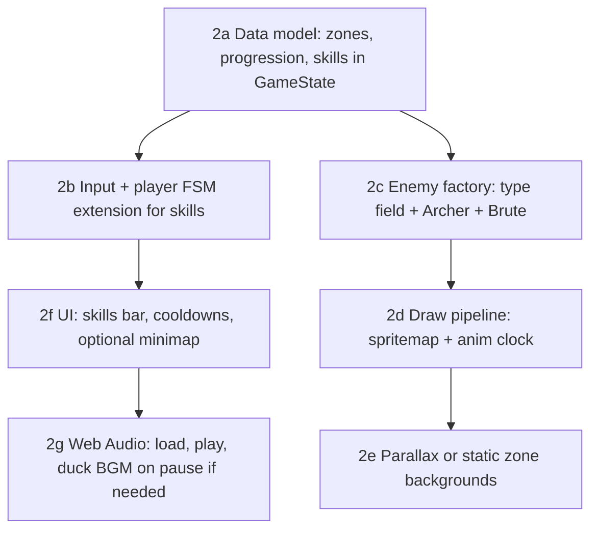

# Wardenfall — Phase 2 plan (Content & feel)

**Prerequisite:** [Phase 1](PHASE1_EXECUTION.md) complete — combat loop, slimes, round win/lose, `GameState` as data, Canvas render.  
**Out of scope:** Phase 3+ — multiplayer, Colyseus, server authority, auth.

**Roadmap (from product spec, months 3–6):** art direction, 16×16 sprites + sheets, two new enemy archetypes, three player skills, audio, richer UI, three zones, simple XP/level/stats (no full skill tree).

This document is the **execution shape**; dates and resourcing are up to the team.

---

## 1. Objectives (what “done” means)

1. The game is **visually readable** (sprites + backgrounds) without relying on colored rectangles for actors.
2. **Content breadth:** at least two new enemy *behaviors* (e.g. ranged + tank) plus Slime, sharing one update pattern in code.
3. **Player options:** three bound skills with **cooldowns and feedback** in UI (icons optional if schedule slips; text fallback OK).
4. **World structure:** **three** distinct “zones” (separate `GameState` layouts or a small zone loader) with transitions (fade + spawn point).
5. **Light progression:** XP → level; **three** core stats (e.g. str / vit / agility) with simple derived effects (damage / HP / move) — no sprawling trees.
6. **Audio present:** BGM loop + a minimal set of SFX (hit, hurt, jump, UI) via Web Audio API (or a thin wrapper), files under `assets/audio/` or `public/`.

---

## 2. Dependency order (recommended)

- **Start with data + simulation** (2a–2c) so art can hook into stable state shapes.  
- **Render/animation (2d–2e)** can track in parallel once entity `animState` + `frame` exist in state or a thin per-entity `visual` sub-object (keep **network-shaped** for Phase 3: prefer fields on existing entities over heavy scene graphs).

---

## 3. Work breakdown

### 2a — `GameState` and zone loading

| Item | Action |
|------|--------|
| Zone identity | `currentZoneId: 'forest' \| 'ruins' \| 'cave'` (or numeric enum + table in `Constants.js` / `data/zones.js`). |
| Layouts | Per zone: `platforms[]`, `enemies[]` (with `type: 'slime' \| 'archer' \| 'brute'`), `spawn` / `levelW` / `levelH` / `bg` key. |
| Transitions | On door or end trigger: set `roundState: 'loading'` (optional) → replace geometry + entities from zone preset → `roundState: 'playing'`. Reuse or extend `resetRun` to accept zone, or add `loadZone(state, id)`. |
| Progression | `player.xp`, `player.level`, `player.stats: { str, vit, agi }` (names flexible); `xpToNext` derived from level curve in one place. |

**Files (typical):** [`src/state/GameState.js`](../src/state/GameState.js), new [`src/data/zones.js`](../src/data/) (or `src/config/Zones.js`), [`src/core/Game.js`](../src/core/Game.js) (transition hook, no gameplay logic in loop beyond orchestration).

### 2b — Skills (three abilities)

| Item | Action |
|------|--------|
| Design | Three distinct roles: e.g. gap-closer, AoE, defensive buff — one active input each (`KeyQ` `KeyE` `KeyR` **conflicts with restart** — use `1` `2` `3` or `Q` `E` `F` in Phase 2; **move restart** to e.g. `Enter` in menu-only or only when `roundState !== 'playing'` already; document binding table). |
| State | `skillSlots[]` with `cooldownTimer`, `lastCastTick`, maybe `activeTimer` for channeled buffs. |
| Update | In `updatePlayer` or new `src/systems/Skills.js` called from `Game._update` after input. No duplicate tick logic. |
| Feel | Tuning only in `Constants.js` (damage multipliers, iframe bonus, etc.). |

**Files:** [`src/entities/Player.js`](../src/entities/Player.js), new `src/systems/Skills.js` (if logic grows), [`src/core/Input.js`](../src/core/Input.js) (new keys + edges), [`Constants.js`](../src/config/Constants.js).

### 2c — Enemies: Archer, Brute

| Item | Action |
|------|--------|
| Pattern | `updateEnemies` dispatches on `e.type` or `updateEnemy(e, state)` switch; shared helpers for LOS, gravity, `clampToLevel`. |
| Archer | Ranged telegraph, projectile entity or instant ray with delay (simplest: slow projectile in `state.projectiles[]`). |
| Brute | Higher HP, shorter telegraph, contact or shockwave — extend existing melee pipeline in [`Combat.js`](../src/systems/Combat.js). |
| `GameState` | `enemies[]` already exists; add fields only where needed; document transients. |

**Files:** [`src/entities/Enemy.js`](../src/entities/Enemy.js) (split or add modules `Archer.js` / `Brute.js` if file exceeds ~300 lines), [`src/systems/Combat.js`](../src/systems/Combat.js), [`src/state/GameState.js`](../src/state/GameState.js).

### 2d — Spritesheets and animation

| Item | Action |
|------|--------|
| Authoring | LibreSprite (or Aseprite) → PNG sheets + JSON **or** single row + `frameW`, `frameH` in `Constants.js`. |
| State → frame | `player.anim: 'idle' | 'run' | ...` updated in movement/combat; `player.animFrame` + `animTime` in state **or** derivable from `tick` + `animStartTick` to stay deterministic. |
| Draw | In [`Render.js`](../src/systems/Render.js): `drawImage(image, sx, sy, sw, sh, dx, dy, ...)`; preload in `main.js` or an `src/assets/loader.js` `Promise` before `game.start()`. |
| Parity | If Phase 3 net sync needs fewer fields, keep anim as **client-only** in a `renderModel` or strip before snapshot (document in `GameState` header). |

### 2e — Backgrounds and “style bible”

| Item | Action |
|------|--------|
| Art | One master prompt + palette locked per zone (doc in `docs/STYLE_BIBLE.md`: colors, line weight, 16×16 rules). |
| Parallax | 2–3 layers (`bgLayers[]` with `scrollFactor`, draw back-to-front before platforms) **or** single full-bleed image per zone for time savings. |
| Size | 1920×1080 design safe area with letterboxing if canvas stays 960×540, or scale draw. |

**Files:** [`Render.js`](../src/systems/Render.js), optional [`src/render/Backgrounds.js`](../src/render/), new assets under `wardenfall/assets/`.

### 2f — UI expansion

| Item | Action |
|------|--------|
| Skills | Cooldown sweep or numeric timer on 3 slots; re-use HP bar style from [`UI.js`](../src/systems/UI.js). |
| Minimap | Optional: rectangle with dots for player + enemies; cut if over budget. |
| XP/level | Thin bar or text: `LV 3 — XP 120/200`. |
| Zoning | “Forest / Ruins / Cavern” title on zone change (2 s fade). |

### 2g — Audio

| Item | Action |
|------|--------|
| BGM | One loop per zone or one global track + cross-fade. |
| SFX | `AudioBuffer` cache; trigger from `Combat`, `Player` (land, hurt), `UI` (ability ready). |
| Policy | Mute in `state.settings.muted` for accessibility; persist `localStorage` (optional). |

**Files:** new `src/audio/AudioManager.js` (or minimal functions in `src/core/audio.js`).

---

## 4. Milestone checklist (suggested)

| ID | Milestone | Exit criteria |
|----|-----------|---------------|
| P2-M1 | Zones + progression data | Load three zone layouts; XP/level/3 stats affect at least one combat number (e.g. damage). |
| P2-M2 | Skills + input | Three abilities usable, cooldowns visible, no R-key clash with core loop. |
| P2-M3 | New enemies | Archer + Brute beatable; tuned via `Constants.js`. |
| P2-M4 | Art pass | Placed assets for player + all enemy types; backgrounds per zone. |
| P2-M5 | Audio + UI polish | BGM + SFX; skill/XP UI complete; **style bible** written. |

---

## 5. Risks and mitigations

| Risk | Mitigation |
|------|------------|
| R key vs skill slot | Rebind skills to `1–3` or `Q/E/F`; keep **R** for end-of-round only or document explicitly. |
| `GameState` bloat | Per-zone `projectiles` array cleared on zone change; no global singletons. |
| Animation blocking gameplay | Anims are **cosmetic** until frame-accurate hitbox sync is required (late Phase 2/3). |
| Scope creep (full metroid map) | Minimap = optional; three **linear** rooms + transitions if time is short. |

---

## 6. Definition of done (Phase 2)

- Three zones playable end-to-end with at least one transition each.
- 16×16+ sprite **representation** of player and enemies; backgrounds distinguish zones.
- Three skills with cooldowns and UI.
- Two new enemy types in addition to slime, with fair telegraphs.
- XP/level/three stats wired with simple curves.
- Audio: loop + essential SFX.
- No server code; `GameState` still data-first (transients documented for future snapshots).

---

*Created for alignment with the Wardenfall roadmap. Adjust naming (Wayfinder vs Wardenfall) when product branding is finalized.*
